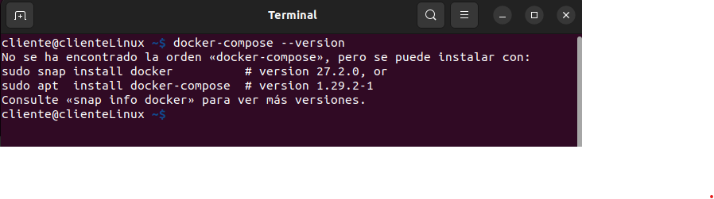

# Ejercicio 4 - Docker Compose

> Proyecto Docker: Sara García Barbas y Gerald Alexis Rueda Tejedo
> 

# Introducción

En este tutorial desplegaremos **`htop`** en un contenedor Docker utilizando **Docker Compose**. **`htop`** es una herramienta interactiva que permite monitorear procesos en sistemas basados en Unix de manera visual e intuitiva.

Docker Compose facilita la gestión de contenedores, permitiendo definir y ejecutar aplicaciones multicontenedor con un solo archivo de configuración. Configurar **`htop`** en un contenedor es útil para monitorear el rendimiento de un sistema de forma aislada o dentro de un entorno de desarrollo.

Al finalizar este tutorial, tendremos un contenedor con **`htop`** en ejecución y podremos usarlo para visualizar el consumo de CPU, memoria y otros recursos en tiempo real.

# ¿Qué es Docker Compose?

**Docker Compose** es una herramienta que permite definir y gestionar aplicaciones multi-contenedor en **Docker** utilizando un solo archivo de configuración, generalmente llamado **`docker-compose.yml`**.

Con **Docker Compose**, en lugar de ejecutar y configurar cada contenedor manualmente con comandos de `docker run`, podemos definir todos los servicios, volúmenes, redes y variables de entorno en un archivo YAML. Luego, con un solo comando (`docker-compose up`), Docker se encarga de construir y ejecutar toda la aplicación.

# ¿Qúe es `htop`?

**htop** es una herramienta de monitoreo de procesos interactiva para sistemas **Unix** (Linux, macOS, BSD) que permite visualizar en tiempo real el uso de CPU, memoria, procesos y otros recursos del sistema. Es una alternativa más avanzada y amigable a `top`, con una interfaz más intuitiva y colorida.

# Paso 1

En nuestra máquina virtual abrimos un terminal y comprobamos si tenemos `docker-compose`instalado

```bash
docker-compose --version
```



Si no lo tenemos instalado, ejecutaremos:

```bash
sudo apt install docker-compose -y
```


Si comprobamos la versión, vemos que ahora ya si lo tenemos instalado:

```bash
docker-compose --version
```


# Paso 2

En nuestra máquina virtual creamos un nuevo directorio al que llamaremos `htop`, y este será sobre el que trabajaremos. Yo he creado el directorio en `/home/cliente/Documentos/htop`


Desde el directorio que acabamos de crear, abrimos un terminal


Vamos a crear nuestro archivo `compose.yaml` y añadirle el siguiente contenido:

```bash
nano docker-compose.yaml
```


**¿Por qué la imagen Alpine?**

Alpine Linux es una distribución de Linux minimalista y liviana, ideal para contenedores Docker por lo siguiente:

- **Es pequeña** (~5 MB), reduciendo así el tiempo de descarga y arranque.
- **Es segura**.
- **Es eficiente**, usa `musl` y `busybox` en lugar de `glibc` y herramientas más pesadas.

**¿Qué es Alpine?**

Es un sistema operativo basado en Linux, diseñado para ser **ligero y seguro**. Se usa mucho en Docker porque consume menos recursos que distribuciones como Ubuntu o Debian.

La combinación de **Alpine Linux** con **htop** en Docker es útil por:

1. **Ligereza:** Alpine es una imagen mínima (~5 MB), lo que hace que el contenedor sea rápido y eficiente.
2. **Monitorización sin sobrecarga:** `htop` permite visualizar el uso de CPU, memoria y procesos sin consumir muchos recursos.
3. **Simplicidad:** Solo necesitamos instalar `htop` con `apk add --no-cache htop` y ejecutarlo.

Esta combinación es ideal para depurar o monitorear procesos dentro de un contenedor sin inflar su tamaño.

**¿No podemos usar solo `htop`?**

No se puede usar `htop` solo en Docker porque **necesita un sistema operativo base**. Docker no ejecuta aplicaciones de forma independiente, sino dentro de contenedores basados en imágenes de sistemas como **Alpine, Ubuntu o Debian**.

# Paso 3

Abrimos un terminal en la carpeta donde guardamos el archivo `docker-compose.yaml` y ejecutamos:


```bash
docker-compose up
```


Ahora ejecutamos:

```bash
docker ps
docker exec -it 6b149a8f1cee htop
```


Se nos iniciará la interfaz de `htop` y ya podremos usarlo:


Si presionamos la tecla F1 o sobre el texto `Help`veremos las distintas funcuionalidades de htop y las teclas asociadas a dichas funcionalidades:


Las principales acciones que podremos realizar son:

1.  **Ver el uso del sistema**
    - **CPU**: Muestra el uso de cada núcleo de la CPU en tiempo real con gráficos de barras.
    - **Memoria**: Visualizar el uso de la RAM y swap.
    - **Carga del sistema**: Muestra la carga promedio del sistema (load average).
2. **Gestionar procesos**
    - **Ver procesos activos**: Muestra una lista completa de los procesos en ejecución, con detalles como PID, usuario, uso de CPU y memoria.
    - **Ordenar procesos**: Podremos ordenar los procesos por uso de CPU, memoria, nombre, etc. (Tecla F6).
3. **Buscar y filtrar procesos**
    - **Buscar un proceso**: Presionando F3 y escribiendo el nombre del proceso para buscarlo.
    - **Filtrar procesos**: Usar F4 para aplicar filtros a los procesos que se están mostrando, por ejemplo, por nombre.
4. **Matar procesos**
    - **Matar un proceso**: Seleccionando un proceso y presionando F9 para terminarlo (se pueden elegir diferentes señales para terminar el proceso, como SIGTERM o SIGKILL).
5. **Ver la jerarquía de procesos**
    - **Modo árbol**: Cambia la vista para mostrar los procesos en forma de árbol jerárquico con F5, lo que ayuda a ver qué procesos son padres e hijos.
6. **Cambiar la prioridad de los procesos**
    - **Cambiar la prioridad**: Usando F7 y F8 para ajustar la prioridad de un proceso (cambiar su "nice value").
7. **Personalización**
    - **Configurar la visualización**: Presionando F2 abriremos el menú de configuración, donde podremos cambiar cómo se muestran los procesos y ajustar las opciones de visualización.
8. **Ver estadísticas detalladas**
    - También podremos ver detalles sobre el uso del sistema, como las interrupciones, los contextos de los procesos, el uso de discos, etc.