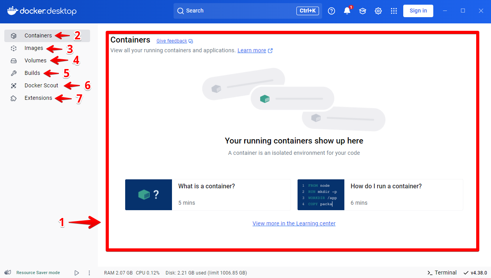

# Ejercicio 1 - Manual de Docker Desktop

> Proyecto Docker: Sara García Barbas y Gerald Alexis Rueda Tejedo
> 

# Introducción

Docker Desktop es una aplicación que nos permite crear, gestionar y ejecutar contenedores en entornos Windows y macOS de manera sencilla. Proporciona una interfaz gráfica para manejar contenedores sin necesidad de usar la línea de comandos. En este documento se proporcionará una guía para facilitar su uso.

# 1. Interfaz de la aplicación



Interfaz docker Desktop

Al abrir Docker Desktop veremos el panel principal con diferentes secciones:

1. **Dashboard**: Vista general de los contenedores en ejecución.
2. **Containers**: Lista de contenedores activos e inactivos.
3. **Images**: Almacén de imágenes descargadas.
4. **Volumes**: Espacio de almacenamiento persistente.
5. **Builds:** Historial y monitoreo de compilaciones de imágenes.
6. **Docker Scout:** Análisis de seguridad y mejores prácticas para imágenes.
7. **Extensions:** Administración e instalación de extensiones para ampliar funcionalidades.

# 2. Images

La pestaña **Images** nos permite administrar todas las imágenes de Docker disponibles en el sistema.

## **2.1 Descargar una Imagen**:

- Ir a la pestaña **Images**.
- Abrir la terminal y escribir el comando para descargar las imágenes que queramos. En este ejemplo descargaremos las imágenes de `mariadb`y la de `tomcat`:

<aside>
📌

No podremos explicar como descargar imágenes desde Hub Repositories ya que la conexión de internet del aula no nos permite inciar sesión con nuestro usuario Docker.

</aside>

```bash
docker pull mariadb
docker pull tomcat
```


- Las imágenes se añadirán a la lista.


## **2.2 Eliminar una Imagen**:

- Ir a **Images**.
- Presionar sobre el icono de eliminar de la imagen deseada.


- También podemos seleccionar la imagen que queramos y presionar sobre el botón Delete.


## **2.3 Inspeccionar una Imagen**:

- En la pestaña **Images**, hacer clic sobre el nombre de una imagen.
- Podremos ver detalles de la imagen como:
    - El nombre y el identificador.
    - La etiqueta de la imagen.
    - El estado: si está en uso o no.
    - El tiempo de creación.
    - El tamaño.

También podremos ver las acciones que podemos realizar sobre la imagen:

- **Run**: Nos permite la ejecución de un contenedor.
- **View packages and CVEs**: Nos lleva a la información de la imagen, donde entre otras cosas podremos ver los ficheros y las vulnerabilidades de la imagen.
- **Delete**: Nos permite borrar la imagen del registro local.


- **Pull**: Nos permite bajar la imagen a nuestro registro local si ha sido modificada.
- **Push to Doker Hub**: Nos permite subir la imagen a Docker Hub.


Además, también podremos ver detalles relacionados con:

- **Image hierarchy**: Los comandos que se han ejecutado para crear la imagen. Similar al comando `docker history`.
- **Vulnerabilidades**: Lista de vulnerabilidades encontradas en los distintos paquetes instalados en la imagen.
- **Paquetes**: Lista de paquetes que tiene instalada la imagen.


# 3. Containers

La pestaña Containers ****nos permite administrar todos contenedores de Docker disponibles en el sistema.

## 3.1 Crear un contenedor

Partiendo de una imagen que tengamos en el registro local podemos ejecutar un nuevo contenedor con la opción **Run**. También podemos crear contenedores desatendidos (opción `-d` en `docker run`) y los datos que podremos configurar serán los siguientes:

- El nombre del contenedor.
- El mapeo de puertos.
- El almacenamiento, volúmenes docker o bind mount.
- Las variables de entorno.


## 3.2 Listado de los contenedores y sus opciones

Al entrar en la vista de contenedores, vemos los contenedores que tenemos creados, con la siguiente información:

- El nombre e identificados de los contenedores.
- La imagen desde la que se ha creado.
- El mapeo de puertos. si pulsamos sobre esta información se abrirá el navegador y nos permitirá acceder a la aplicación que sirve el contenedor.
- El estado (En ejecución, parado, etc).
- El porcentaje de CPU que está utilizando.


Las tareas que podremos ejecutar con los contenedores son **iniciar/parar** el contenedor, **eliminar** el contenedor y más las que encontramos en el menú de acciones:


- **View details**: Nos da información del contenedor.
- **View packages and CVEs**: Nos lleva a la información de la imagen.
- **Copy docker run**: Nos permite copiar en el portapapeles la instrucción `docker run` que crea el contenedor.
- **Open in terminal**: Nos permite acceder interactivamente al contenedor.
- **View files**: Nos permite ver los ficheros que hay en el sistema de archivos del contenedor.
- **Pause**: Nos permite pausar el contenedor.
- **Restart**: Nos permite reiniciar el contenedor.
- **Open with browser**: Nos permite acceder a la aplicación en un navegador web.

## 3.3 **Inspeccionar un contenedor**

Pulsando sobre el nombre de un contenedor, nos aparecerá una pantalla donde podremos ver distintas detalles del contenedor:

- **Logs**: Muestra los logs del contenedor.


- **Inspect**: Muestra información detallada del contenedor. Podemos selección determinada información que nos interesa.


- **Bind mounts**: Muestra los directorios que tenemos montados en el contenedor.


- **Exec**: Nos permite acceder interactivamente al contenedor.


- **Files**: Obtenemos las lista de ficheros que tiene el contenedor y nos indica cual ha sido modificado.


- **Stats**: Nos mustra distintas gráficas de uso de recursos (CPU, memoria RAM, lectura/escritura de disco, E/S de red,...).


# 4. Volumes

La pestaña Volumes ****nos permite administrar los Volúmenes de Docker disponibles en el sistema.

## 4.1 Crear un volumen

Para crear un volumen simplemente debemos:

1. Clicar en el botón `Create`
2. Dar un nombre a nuestro volumen y pulsar sobre `Create`


## 4.2 Listado de volúmenes

En la vista de **Volumes** podemos acceder a la lista de volúmenes disponibles. 


Veremos datos como:

- Nombre
- Cuando fue creado
- Su tamaño

Y podremos realizar acciones como:

- Clonar el volumen
- Eliminar el volumen

## 4.3 Inspeccionar un volumen

Si pulsamos sobre el nombre de un volumen obtendremos información más detallada y otra serie de acciones que podremos realizar con el:


Podremos ver que contenedor está haciendo uso de el y realizar acciones como eliminarlo, importarlo o vaciar el volumen.

# 5. Builds

La vista de **Builds** (construcción de imágenes) nos permitirá inspeccionar nuestro historial de construcciones además de gestionarlas.


Desde esta vista podremos ver datos como el nombre o el ID. Además también podremos realizar acciones como importar construcciones o eliminar alguna de las que tengamos

## **5.1 Inspeccionar construcción**

Si accedemos a la información a una construcción ya finalizada podemos obtener la siguiente información:


- **Info**: Muestra información sobre diferentes aspectos de la construcción:
    - **Source details**: Información sobre el fichero `Dockerfile` , por ejemplo el repositorio donde se encuentra.
    - **Build timing**: Gráficos que muestran información de la construcción:
        - Tiempo real: tiempo total de construcción.
        - Tiempo acumulado:  tiempo total de uso de CPU para realizar la construcción.
        - Uso de caché: información sobre el almacenamiento en caché de la construcción.
        - Ejecución paralela: tiempo de ejecución de la compilación que se dedicó a ejecutar pasos en paralelo.
    - **Dependencies**: Imágenes y recursos remotos utilizados durante la construcción:
        - Imágenes de contenedores utilizadas durante la construcción.
        - Repositorios Git incluidos mediante la instrucción `ADD` en el fichero `Dockerfile`.
        - Recursos HTTPS remotos incluidos mediante la instrucción `ADD` en el fichero `Dockerfile`.
    - **Configuration**: Parámetros pasados a la construcción:
    - **Build results**: Resumen de los artefactos de compilación generados.
- **Source**: Muestra el fichero `Dockerfile` usado para la construcción. Si hay un error en la construcción nos señalará el error en esta pestaña.
- **Logs**: Muestra la salida de la ejecución de los distintos pasos que se ejecutan en la construcción y están indicados en el fichero `Dockerfile`.
- **History**: Muestra datos estadísticos sobre las construcciones completadas.

<aside>
📌

Nota: Si accedemos al detalle de una construcción activa, sólo podremos acceder a los logs de dicha construcción.

</aside>

# 6. Docker Scout

**Docker Scout** es una funcionalidad que analiza imágenes para detectar vulnerabilidades y mejorar la seguridad. Sus principales usos son:

- **Análisis de seguridad**: Escanea imágenes en busca de vulnerabilidades conocidas en sus dependencias.
- **Recomendaciones de seguridad**: Proporciona sugerencias para actualizar paquetes o usar versiones más seguras.
- **Monitoreo de cumplimiento**: Ayuda a verificar si las imágenes cumplen con buenas prácticas y políticas de seguridad.


Vista antes de analizar la imagen mariadb:latest


Vista después de analizar la imagen mariadb:latest

# 7. Extensions

La vista de Extensions nos permitirá buscar, crear y gestionar las extensiones que tengamos añadidas.


Para instalar una extensión simplemente deberemos situarnos en la pestaña `Browser` , buscaremos la extensión que deseemos instalar y pulsaremos sobre el botón `Install`.


En la pestaña `My Extensions` veremos las extensiones que tenemos instaladas. Desde esta pestaña podremos:

- Abrir una extensión
- Compartir una extensión
- Desinstalar una extensión