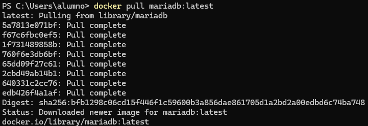

# Sin título

Ejercicio 2 - Servidor de base de datos

> Proyecto Docker: Gerald Alexis Rueda Tejedo y Sara García Barbas
> 

# Paso 1

Abre Docker Desktop. Busca `mariadb` en la sección de imágenes. Selecciona la imagen
oficial. Descárgala si no la tienes.

<aside>
❗

No podemos descargar la imagen de mariadb desde Docker Desktop porque no nos permite logearnos. Vamos a descargar la imagen desde la terminal.

</aside>

Para ello escribimos:

```bash
docker pull mariadb:latest
```



Si vamos a docker desktop la vemos descargada


# Paso 2

Despliega un contenedor utilizando esa imagen. Características:

- Nombre del contenedor: bbdd .
- Puerto: 3306 - debe poder conectarse externamente
- Utiliza un volumen llamado datos-mariadb .
- Usa las variables de entorno necesarias para que el usuario root tenga la password
root , la base de datos por defecto sea base , y se cree un usuario daw , con
password daw .
    
    Primero vamos a crear un volumen.
    
    Para crear un volumen vamos a la pestaña de volumen
    
    
    
    Introducimos el nombre del volumen
    
    
    
    Vemos como el volumen se ha creado
    
    
    
    Ahora vamos a imágenes y clicamos en el símbolo de reproducir
    
    
    
    Rellenamos los campos que nos pide
    
    
    


# Paso 3

Arranca el contenedor.

Para ello le damos al boton `run`


Vemos que no sale arrancado, ya que tenemos seleccionada la opción de que solo muestre contenedores activos


# Paso 4

Accede a la base de datos usando una herramienta gráfica, como, por ejemplo `dbeaver` .
Conéctate con el usuario daw . Crea una base de datos y alguna tabla.

Vemos que al conectarnos como root a la base de datos con la herramienta `dbeaver` se ha creado el usuario `daw` y la base da datos `base`


Ahora vamos acceder con el usuario `daw`


Una vez conectados creamos una nueva base de datos llamada `prueba`


Nos da un error porque el usuario no tiene permisos para crear bases de datos


Para solucionar este problema, en la sesion que tenemos activa con root, le damos click derecho y clicamos `editor sql.`


Creamos un nuevo script sql para modificar los permisos del usuario `daw` con el siguiente contenido

```sql
GRANT CREATE, CREATE ON *.* TO 'daw'@'%';
FLUSH PRIVILEGES;
```

📌 **Explicación**:

- `GRANT CREATE ON *.*` → Permite crear bases de datos en todo el servidor.
- `'daw'@'%'` → Aplica estos permisos al usuario **daw** desde cualquier host (`%`).
- `FLUSH PRIVILEGES;` → Aplica los cambios inmediatamente.

Ahora vemos como ya hemos podido crear la base de datos `prueba`


<aside>
🚨

IMPORTANTE: Modificar los privilegios del usuario daw para que pueda modificar la base de datos `prueba`

</aside>

Para ello ejecutamos el siguiente comando:

```sql
GRANT REFERENCES ON `prueba`.* TO 'daw'@'%';
FLUSH PRIVILEGES;
```

Ahora vamos a crear algunas tablas dentro de la base de datos `prueba` , para ello vamos a hacerlo mediante el siguiente script

```sql
-- Crear la base de datos si no existe
CREATE DATABASE IF NOT EXISTS prueba;
USE prueba;

-- Crear la tabla personas
CREATE TABLE IF NOT EXISTS personas (
    id INT AUTO_INCREMENT PRIMARY KEY,
    nombre VARCHAR(50) NOT NULL,
    apellido VARCHAR(50) NOT NULL,
    edad INT CHECK (edad >= 0),
    email VARCHAR(100) UNIQUE
);

-- Crear la tabla coches
CREATE TABLE IF NOT EXISTS coches (
    id INT AUTO_INCREMENT PRIMARY KEY,
    marca VARCHAR(50) NOT NULL,
    modelo VARCHAR(50) NOT NULL,
    año INT CHECK (año >= 1886), -- Año del primer automóvil
    propietario_id INT,
    FOREIGN KEY (propietario_id) REFERENCES personas(id) ON DELETE SET NULL
);

```

Este script crea una tabla personas y otra tabla coches

Creamos el script y le damos al botón ejecutar


Vemos como se han creado las tablas


# Paso 5:

Borra el contenedor

Para borrar el contenedor, vamos a la pestaña `containers` y le damos al icono de la papelera


Vemos que ya no aparece


# Paso 6:

Ver en Docker Desktop que el volumen que contiene los datos no se ha borrado.

Vemos que en la pestaña  `volumes` sigue apareciendo


# Paso 7:

Crear otro contenedor con un servidor de base de datos que use el mismo volumen.
Llamar al contenedor `bbdd-2` . Comprobar que la base de datos y la tabla creada
anteriormente siguen ahí.

Hacemos lo mismo que anteriormente para crear el contenedor


Vemos como usa el mismo contenedor que anteriormente

Si accedemos ahora a la bbdd vemos que la bbdd `prueba` y sus tablas siguen ahi sin nosotros haberlas creado en este contenedor


# Paso 8

Intenta borrar la imagen de `mariadb` ¿Qué sucede?


Da un mensaje de error, diciendo que el contenedor `bbdd-2` lo está utilizando

# Paso 9

Borra todo, volumen, imagen y contenedor.

Borrado de contenedor


Borrado imagen


Borrado volumen

