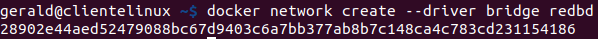

# Ejercicio 3 - contenedores en red: Adminer y MariaDB

> Tarea docker: Gerald y Sara
> 

# Paso 1

**Crea una red bridge `redbd`**

```bash
docker network create --driver bridge redbd

```



**Parámetros de la red `redbd`**

```bash
docker network inspect redbd
```


# Paso 2

**Crea un contenedor con una imagen de `mariaDB` que estará en la red `redbd` . Este
contenedor se ejecutará en segundo plano, y será accesible a través del puerto 3306. (Es
necesario definir la contraseña del usuario `root` y un volumen de datos persistente)**

```bash
docker run -d --name contenedor_mariadb --network redbd \
  -e MYSQL_ROOT_PASSWORD=root \
  -v mariadb_data:/var/lib/mysql \
  -p 3306:3306 \
  mariadb
```


# Paso 3

**Crear un contenedor con `Adminer` o con `phpMyAdmin` que se pueda conectar al
contenedor de la BD**

```bash
docker run -d --name contenedor_adminer --network redbd -p 8080:8080 adminer
```


Vemos que los dos contenedores están ejecutandose

```bash
docker ps
```


# Paso 4

## Desde dbeaver

**Desde la interfaz gráfica, crear una base de datos y una tabla en el servidor de base de datos**

Accedemos a la base de datos con la aplicación `dbeaver`


Vamos a crear un base de datos


Vamos a crear la tabla `personas`y `coches` mediante un script en la base de datos

Para ello abrimos un script


Escribimos el script y le damos al botón de ejecutar


Vemos que se han creado las tablas


## Desde adminer

Ahora vamos a conectar con adminer, para ello en un navegador escribimos `http://localhost:8080`


Introducimos los datos para acceder en este caso a la base de datos creada previamente 


Vemos las tablas creadas anteriormente


Vamos a crear una tabla nueva desde `adminer`

Para ello le damos en el botón `crear tabla` e introducimos el nombre de la tabla y los campos que queremos que contenga


Vemos como se ha creado la tabla `mecánicos`


Ahora vamos a crear una base de datos nueva, para ello pinchamos en el nombre del servidor, en este caso `contenedor_mariadb` y le damos al botón `crear base de datos`


Introducimos el nombre de la base de datos y le damos a guardar


Vemos como se ha creado


# Paso 5

**Borrar los contenedores, la red y los volúmenes utilizados - desde comando o utilizando
Docker Desktop**

Vamos a empezar borrando los contenedores, para ello primero vamos a tener que pararlos

```bash
docker stop contenedor_adminer
docker stop contenedor_mariadb
```


Ahora ya podemos borrarlos

```bash
docker rm contenedor_adminer
docker rm contenedor_mariadb
```


Comprobamos que se han borrado los contenedores

```bash
docker ps -a
```


Vemos que ya no aparecen

Ahora vamos a eliminar la red

```bash

docker network rm redbd
```


Comprobamos que se ha borrado la red

```bash
docker network ls
```


Por último eliminamos el volumen

```bash

docker volume rm mariadb_data
```


Comprobamos que se ha eliminado el volumen

```bash
docker volume ls
```

