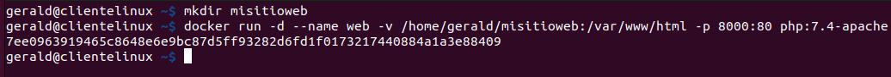

# Ejercicio 5 - Imagen con Dockerfile - Aplicación Web

> Tarea Docker: Gerald Alexis Rueda Tejedo y Sara García Barbas
> 

# Paso 1

**Arranca un contenedor que ejecute una instancia de la imagen `php:7.4-apache` , que se
llame web y que sea accesible desde un navegador en el puerto `8000`.**

Primero vamos a crear un directorio donde vamos a almacenar la páginas de nuestro sitio web y luego vamos a hacer que el contenedor almacene los datos de `/var/www/html` en ese directorio con un bind mount.

```bash
mkdir mitisioweb
docker run -d --name web -v /home/gerald/misitioweb:/var/www/html -p 8000:80 php:7.4-apache
```



# Paso 2

**Coloca en el directorio raíz del servicio web ( `/var/www/html` ) un "sitio web" donde figure
el nombre de los componentes del grupo - el sitio deberá tener al menos un archivo
`index.html` y un archivo `.css`**

Creamos el sitio web index.html


Con su CSS:


Y el `script.php`:


Copiamos los archivos a `/var/www/html` :


# Paso 3

**Coloca en ese mismo directorio raíz el siguiente script `php`**

```php
<?php
		setlocale(LC_TIME, "es_ES.UTF-8");
		$mes_actual = strftime("%B");
		$fecha_actual = date("d/m/Y");
		$hora_actual = date("H:i:s");
		echo "<h1>Información</h1>";
		echo "<p>Hoy es $fecha_actual</p>";
		echo "<p>El mes es: <strong>$mes_actual</strong></p>";
		echo "<p>Hora: $hora_actual</p>";
?>
```

Ya lo hemos hecho en el paso anterior 😅

# Paso 4

**Ver la salida del script y de la página `index` en el navegador**

Como hemos creado un bind mount debemos cambiar los permisos de nuestra carpeta:

```bash
sudo chown -R www-data:www-data /home/gerald/misitioweb/
sudo chmod -R 777 /home/gerald/misitioweb/
```


Ya vemos nuestra página en el navegador:


# Paso 5

**Automatizar estas operaciones creando un fichero Dockerfile**

Creamos un archivo en el directorio `mistioweb`al que llamaremos `Dockerfile` y le añadiremos el siguiente contenido:


- Este archivo hace lo siguiente:
    - Usa la imagen base de PHP con Apache (`php:7.4-apache`).
    - Establece el directorio de trabajo en `/var/www/html` (el directorio raíz de Apache).
    - Copia todos los archivos desde el directorio local al contenedor.
    - Cambia los permisos de los archivos para que Apache pueda acceder a ellos.
    - Activa el módulo `rewrite` de Apache (por si lo necesitas más adelante para redirecciones o URLs limpias).
    - Expone el puerto 80 para que Apache sea accesible.

# Paso 6

**Subir la imagen a la cuenta de Docker Hub**

Abrimos una terminal en el directorio donde está el `Dockerfile` y ejecutamos:

```bash
docker build -t gesaraweb .
```

Este comando construye la imagen de Docker a partir del `Dockerfile` y la etiqueta como `gesaraweb`.


# Paso 7

Ahora eliminaremos el contenedor `web` original. Luego crearemos un nuevo contenedor con la imagen que acabamos de crear para comprobar que funciona correctamente:

1. Eliminamos el contenedor con el siguiente comando:

```bash
docker rm -f web
```


1. Creamos el contenedor con la imagen

```bash
docker run -d --name web -p 8000:80 gesaraweb
```


1. Comprobamos desde el navegador que vemos nuestro sitio web:


# Paso 8

**Subir a Docker Hub la imagen creada.**

Nos logueamos en Docker Hub para subir la imagen que creamos:

```bash
docker login -u gerald1995
```


Ahora le ponemos un nombre de etiqueta a la imagen (requisito de Docker Hub para poder subir la imagen) y luego ya procedemos a subirla:

```bash
 docker tag gesaraweb gerald1995/gesaraweb:latest
 docker push gerald1995/gesaraweb:latest
```


Ahora comprobamos que la imagen ya aparece en el repositorio de Docker Hub personal:


# Paso 9

Ahora desde la máquina virtual de la otra persona **(cliente@clienteLinux),** descargamos la imagen que habíamos creado anteriormente:

```bash
docker pull gerald1995/gesaraweb:latest
```


Creamos el contenedor con la imagen:

```bash
docker run -d --name nuestrositioweb -p 8000:80 gerald1995/gesaraweb:latest
```


Y comprobamos desde el navegador que vemos la página web desde la máquina virtual de la otra persona **(cliente@clienteLinux)**:

